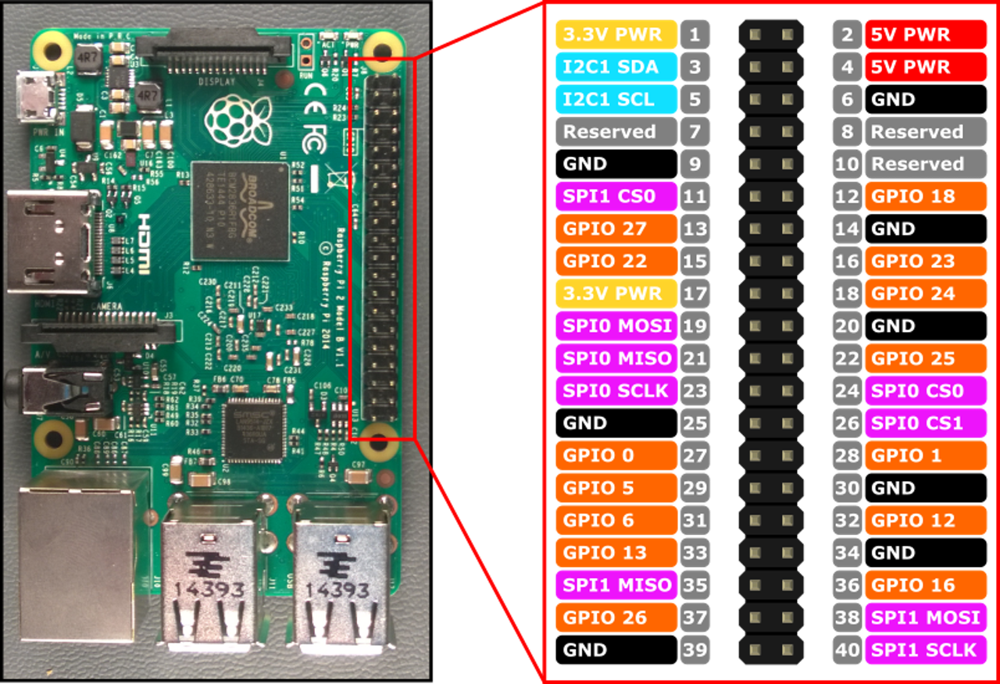

# Mausberry On-Off Switch Installation for Recalbox

## Support

This guide is adapted [from a post](http://blog.recalbox.com/forums/topic/circuit-mausberry-et-recalbox/page/4/#post-16499) by CHB on the blog.recalbox.com forums. Additional shout-outs to [Acris](http://blog.recalbox.com/forums/topic/circuit-mausberry-et-recalbox/page/2/#post-7616) for the initial legwork on the scripts.

Setup instructions for the on-off switch available at [Mausberry Circuits](http://mausberry-circuits.myshopify.com/pages/setup).

## Setup

### Hardware

* Raspberry Pi 2 Model B
* Mausberry Shutdown Switch with Rocker [(Link)](http://mausberry-circuits.myshopify.com/collections/frontpage/products/shutdown-switch-with-rocker)

### Software

* [Recalbox](http://www.recalbox.com/) (v3.3.0-beta17 or higher)

### GPIO Header Leads

- The `out` lead should be attached to `GPIO 23` on the GPIO Header
- The `in` lead should be attached to `GPIO 24`

## Installation

1. Find the Raspberry Pi's IP on the internal network. For the purpose of this guide, we will use `192.168.1.110`.

2. SSH into Recalbox as the user `root`:

`$ ssh root@192.168.1.110`

Password: `recalboxroot`

Upload the 2 scripts in the `scripts` directory to a server and `wget` them into the Recalbox:

`[root@recalbox ~]# wget http://your-server.com/setup.sh`

`[root@recalbox ~]# wget http://your-server.com/S99maus`

Run the `setup` script:

`[root@recalbox ~]# bash setup.sh`

Ensure that the script was installed by checking the file it created:

`[root@recalbox ~]# cat /recalbox/scripts/mausberry.sh`

Copy the `S99maus` file to its intended location:

`[root@recalbox ~]# cp S99maus /etc/init.d/`

`chmod` the file:

`[root@recalbox ~]# chmod 775 /etc/init.d/S99maus`

Finally, launch the script:

`[root@recalbox ~]# /etc/init.d/S99maus start`

The Pi should shut down and your switch should now be functional.

Congratulations, you now have an on/off switch for your Recalbox!